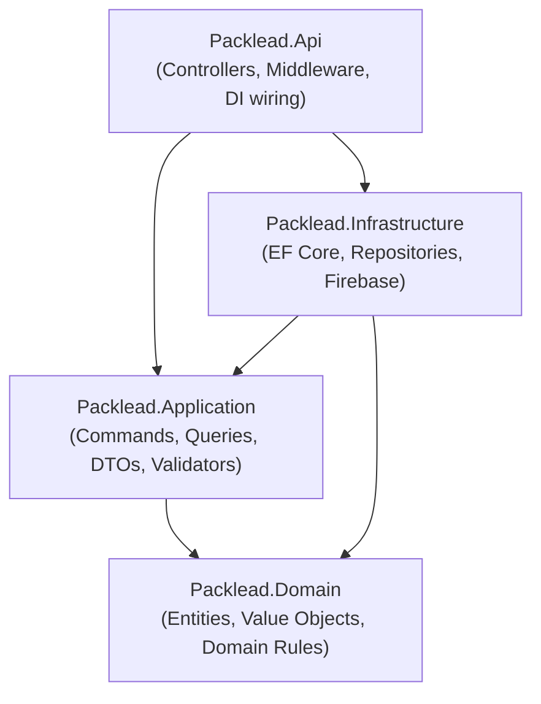
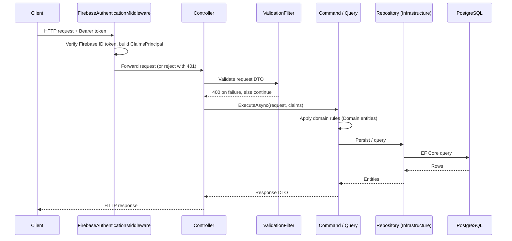

# Architecture

Packlead API is a **layered monolith** built on ASP.NET Core (.NET 10). It is split into four projects with a strict dependency direction: outer layers depend on inner layers, never the other way around.



`Domain` and `Application` never reference `Infrastructure` or `Api`, which keeps business logic and use cases testable in isolation from the database and from Firebase.

---

## Layers

### Packlead.Domain

The innermost layer. Contains only plain C# with no external dependencies.

- **Entities**: `Order`, `Dispatcher` — rich domain models with private setters and behavior-driven mutation (no anemic "get/set everything" objects).
- **Value Objects**: `Location` — an immutable record validating latitude/longitude ranges.
- **Enums**: `OrderState` (`Pending`, `Shipped`, `Delivered`), `DispatcherState` (`Available`, `Inactive`), `UserRole` (used only to type the authenticated user in the API layer — it has no table of its own).
- **Exceptions**: domain-specific exceptions (e.g. `InvalidStateTransitionException`, `InvalidLocationException`) raised when an invariant is violated.

Business rules live here as methods on the entities themselves — for example, an `Order` can only move `Pending → Shipped → Delivered` through explicit methods (`MarkAsShipped()`, `MarkAsDelivered()`), never by free field assignment.

### Packlead.Application

Implements use cases following a lightweight **CQRS-style** pattern — plain command/query classes with an `ExecuteAsync` method, registered directly in DI and injected into controllers. There is no mediator/pipeline library in between.

- **Commands**: `CreateOrderCommand`, `UpdateOrderCommand`, `DeleteOrderCommand`, `CreateDispatcherCommand`, `UpdateDispatcherCommand`, `DeleteDispatcherCommand`.
- **Queries**: `GetAllOrdersQuery`, `GetOrderByIdQuery`, `GetAllDispatchersQuery`, `GetDispatcherByIdQuery`.
- **DTOs**: request/response contracts per feature (e.g. `CreateOrderRequest`, `OrderResponse`, `CreateDispatcherRequest`, `CreateDispatcherResponse`), plus mapping extensions that convert between entities and DTOs.
- **Validators**: FluentValidation validators for each request DTO (e.g. `CreateOrderRequestValidator`).
- **Interfaces**: abstractions consumed by commands/queries and implemented in `Infrastructure` — `IOrderRepository`, `IDispatcherRepository`, `IFirebaseUserService`.
- **Application exceptions**: `AppException`-derived errors that map to specific HTTP status codes (e.g. `OrderNotFoundException` → 404, `DispatcherNotAvailableException` → 409).

### Packlead.Infrastructure

Implements the interfaces defined in `Application` against real external systems.

- **Persistence**: `AppDbContext` (EF Core), entity configurations (`OrderConfiguration`, `DispatcherConfiguration`) using the Fluent API, and migrations.
- **Repositories**: `OrderRepository`, `DispatcherRepository` — thin EF Core-backed implementations of the Application repository interfaces.
- **Firebase**: `FirebaseUserService` — wraps the Firebase Admin SDK to create/delete Firebase users, set custom claims, and generate password reset links.

See [database.md](./database.md) for entity/schema details and [authentication.md](./authentication.md) for the Firebase integration.

### Packlead.Api

The entry point and composition root.

- **Controllers**: `OrdersController`, `DispatchersController` — thin HTTP layer that resolves the caller's identity/claims, invokes the appropriate command/query, and maps results to HTTP responses.
- **Middleware**: `FirebaseAuthenticationMiddleware` (verifies Firebase ID tokens and builds the `ClaimsPrincipal`), `ExceptionHandlingMiddleware` (translates exceptions into a consistent JSON error envelope).
- **Filters**: `ValidationFilter` — runs FluentValidation against incoming request DTOs before the action executes.
- **Handlers**: `NoOpAuthenticationHandler` (satisfies ASP.NET Core's authentication plumbing while the real work happens in middleware), `JsonAuthorizationResultHandler` (returns JSON instead of empty bodies on 401/403).
- **Config**: extension-method modules that wire up DI, authentication/authorization policies, Firebase, validation, and OpenAPI/Scalar in `Program.cs`.

See [api_reference.md](./api_reference.md) for the exposed endpoints.

---

## Request flow



Errors raised anywhere in this flow (domain rule violations, application-level failures, unhandled exceptions) are caught by `ExceptionHandlingMiddleware` and returned using a consistent envelope:

```json
{
  "status": 404,
  "error": "NotFound",
  "message": "Order with id 'abc123' was not found."
}
```

---

## Cross-cutting concerns

| Concern | Implementation |
|---|---|
| Authentication | Custom middleware validating Firebase ID tokens (see [authentication.md](./authentication.md)) |
| Authorization | Policy-based (`AdminOnly`, `DispatcherOnly`, `AuthenticatedOnly`), evaluated from claims set by the auth middleware |
| Validation | FluentValidation, enforced globally via an action filter |
| Error handling | Global exception-handling middleware producing a consistent JSON error envelope |
| API documentation | OpenAPI + Scalar, available at `/scalar` in the development environment |
| Persistence | PostgreSQL via EF Core, one `DbContext` (`AppDbContext`) |

---

## Database communication

Controllers never talk to `AppDbContext` directly. The call chain is always:

```
Controller → Command/Query (Application) → Repository interface (Application) → Repository implementation (Infrastructure) → AppDbContext → PostgreSQL
```

This keeps persistence concerns swappable and lets `Application`-layer tests mock the repository interfaces instead of hitting a real database.
