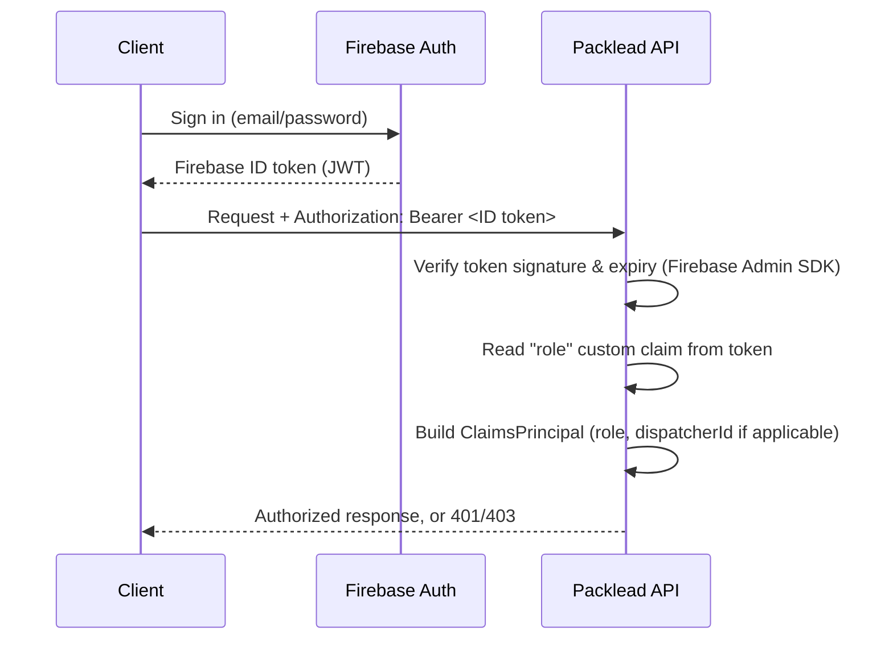

# Authentication

Packlead API delegates identity management to **Firebase Authentication**. The API itself never stores passwords or issues its own tokens — it only verifies tokens issued by Firebase and derives authorization from custom claims attached to the Firebase user.

## Overview



1. Clients authenticate directly against Firebase (outside of this API) and obtain a **Firebase ID token**.
2. Every request to a protected endpoint must include that token as `Authorization: Bearer <token>`.
3. A custom middleware in the API layer verifies the token against the configured Firebase project using the **Firebase Admin SDK**, on every request — there is no local token cache or custom signing involved.
4. If verification succeeds, the API builds an internal `ClaimsPrincipal` from the token's claims and attaches it to the request. If verification fails (missing, malformed, or expired token), the request is rejected with a `401` before reaching any controller.

## Roles

The API recognizes two roles, carried as a custom claim (`role`) on the Firebase user:

- **Admin** — full access to manage orders and dispatchers. There is no `Admin` database table; the role exists purely as a Firebase custom claim.
- **Dispatcher** — scoped access limited to the orders assigned to them. Dispatcher accounts also have a corresponding row in the application database (see [database.md](./database.md)), linked to their Firebase user by UID.

A request without a recognized `role` claim is treated as unauthorized for any role-protected endpoint.

### How the `dispatcher` role is linked to the database

When a token's `role` claim is `dispatcher`, the middleware looks up the matching dispatcher record by Firebase UID and adds the dispatcher's internal identifier as an additional claim on the request. This is what allows dispatcher-scoped endpoints (e.g. listing or updating only their own orders) to work without the client having to supply their own identifier.

### Provisioning an Admin vs. a Dispatcher

- **Dispatchers** are provisioned through the API itself: an admin creates a dispatcher via the API, which creates the corresponding Firebase user (or links an existing one), assigns the `dispatcher` role claim, and returns a password-reset link so the dispatcher can set their own password.
- **Admins** are provisioned out-of-band, directly in the Firebase project — there is no API endpoint for creating or promoting an admin. This is a deliberate boundary: elevating a user to Admin is not something the API surface allows.

## Authorization policies

Once a request has an authenticated `ClaimsPrincipal`, endpoints are protected using three policies:

| Policy | Requirement |
|---|---|
| `AuthenticatedOnly` | Any valid, authenticated user (any recognized role) |
| `AdminOnly` | `role` claim equals `admin` |
| `DispatcherOnly` | `role` claim equals `dispatcher` |

Requests that fail authentication or authorization receive a JSON error response with the same envelope used throughout the API, rather than an empty body:

```json
{
  "status": 401,
  "error": "Unauthorized",
  "message": "..."
}
```