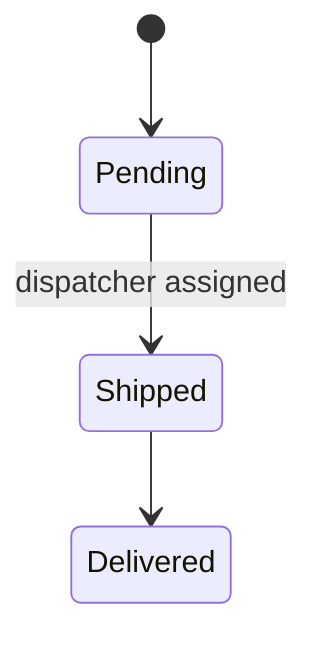

# Database

Packlead API persists data in **PostgreSQL**, accessed through **Entity Framework Core** via a single `AppDbContext`. The schema currently consists of two tables:

## Orders

Represents a delivery order placed by a client.

| Field | Notes |
|---|---|
| `Id` | Primary key |
| `DispatcherId` | Nullable foreign key to `Dispatchers`. `null` until a dispatcher is assigned; set to `null` automatically if the referenced dispatcher is deleted |
| `ClientName`, `ClientPhoneNumber` | Client contact details |
| `Lat` / `Lng` | Delivery coordinates, stored inline on the `Orders` table (not a separate table) — validated to be within valid geographic bounds |
| `Address` | Optional free-text address |
| `Zone` | Delivery zone/area |
| `State` | Order lifecycle status, stored as text |
| `DeliveryDate` | Scheduled delivery date |
| `CreatedAt` | Creation timestamp |

### Order lifecycle

Orders move through a strictly linear set of states, enforced by the application rather than by the database:

- An order cannot move to `Shipped` without a dispatcher already assigned.
- States cannot be skipped or reversed (e.g. `Delivered → Pending` is not a valid transition).

## Dispatchers

Represents a delivery agent. Dispatcher accounts are linked to a Firebase user account (see [authentication.md](./authentication.md)) rather than storing credentials themselves.

| Field | Notes |
|---|---|
| `Id` | Primary key, generated by the application (independent of the Firebase UID) |
| `FirebaseUid` | Unique reference to the corresponding Firebase user — enforced with a unique index |
| `Name`, `Email` | Contact details |
| `Vehicle`, `LicensePlate` | Optional vehicle details |
| `State` | `Available` or `Inactive` |

## Notes

- The **Admin** role has no table of its own — it exists only as a Firebase custom claim, not as application data.
- Relationships: an `Order` optionally belongs to one `Dispatcher`; a `Dispatcher` can have many `Order`s over time. There is no cascading delete from `Dispatcher` to `Order` — removing a dispatcher only clears the assignment on their orders.
- Schema changes are managed through EF Core migrations.