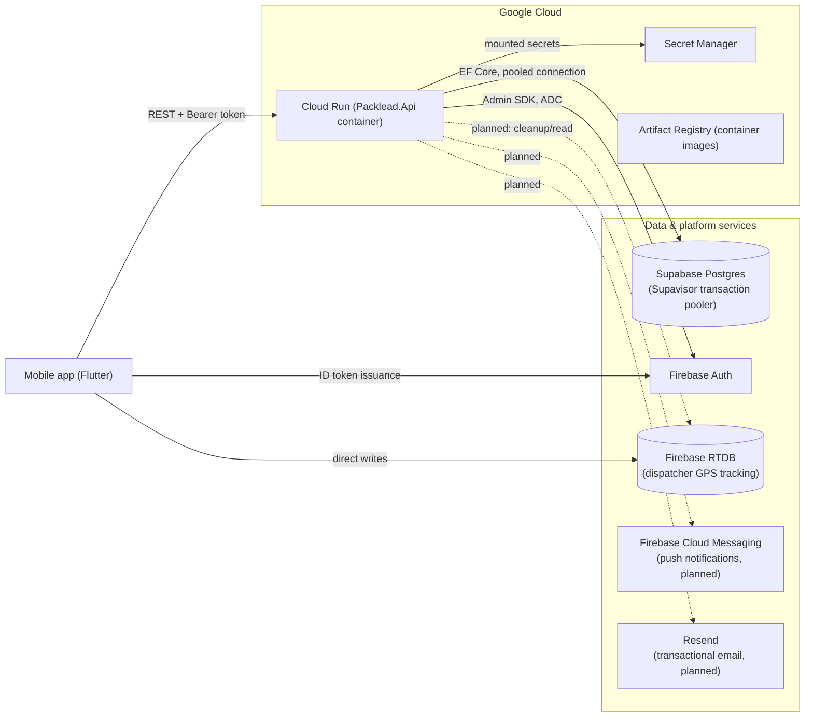
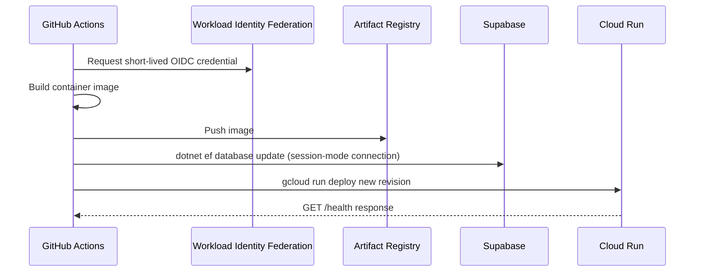

# Deployment Strategy

This document describes the production deployment architecture for the Packlead API on Google Cloud, what has actually been done to stand it up. It doubles as a reusable checklist for deploying a similar ASP.NET Core + EF Core + Firebase backend to Cloud Run in another project.

## Target architecture

The API runs as a serverless container on Cloud Run, backed by a managed Postgres instance (Supabase) reached through its connection pooler, and integrated with Firebase Auth.



### One GCP project, not two

Registering the mobile app with Firebase creates its own backing GCP project, separate from any pre-existing project (e.g. one already used for the Google Maps API). Do the deployment work — Cloud Run, Artifact Registry, Secret Manager, IAM — inside **the Firebase-linked project**, not a separate one. Cloud Run's Admin SDK identity relies on Application Default Credentials (ADC), which resolves without extra IAM plumbing when the service lives in the same project as the Firebase Auth instance it talks to. Other APIs (like Maps) can simply be enabled on that same project rather than split across two.

## Current state vs. target

| Concern | Status | Notes |
|---|---|---|
| Container image | **Done** | Multi-stage `Dockerfile` at repo root (Alpine-based SDK + ASP.NET runtime stages) |
| Local dev parity | **Done** | `docker-compose.yml` runs `postgres` + `api`; `docker-compose.prod-test.yml` runs the image standalone against real Supabase/Firebase credentials for pre-deploy sanity checks |
| HTTPS handling | **Done** | `Program.cs` uses `UseForwardedHeaders()` (trusting `X-Forwarded-Proto`); `UseHttpsRedirection()` removed since Cloud Run terminates TLS at the edge |
| Secrets | **Done** | Production secrets live in Secret Manager, injected into Cloud Run via secret references (see [Phase 3](#phase-3--secrets-management-done)) |
| Container registry | **Done** | Artifact Registry Docker repository, images pushed manually so far |
| Compute | **Done** | Cloud Run service deployed manually from a locally-built image |
| Database migrations | **Automated, in CD** | `dotnet ef database update` now runs as a step in `cd.yml` against Supabase's session-mode connection, before the Cloud Run deploy step; no self-contained bundle yet ([Phase 4](#phase-4--database-migrations-against-supabase-done-simplified)) |
| CI/CD | **Implemented** | `.github/workflows/ci.yml` (PR → `main`) + `.github/workflows/cd.yml` (push to `main`, via Workload Identity Federation) — pipeline is wired up end-to-end  |
| Firebase credentials | **Done** | `FirebaseExtensions.cs` uses a service-account JSON file only in `Development`; every other environment uses `GoogleCredential.GetApplicationDefault()`, so Cloud Run needs no downloaded key at all |

## Phases

Each phase was independently shippable; all six are now at least implemented, with Phase 5 pending a full validated run.

### Phase 1 — Containerize (done)

- Multi-stage `Dockerfile`: Alpine SDK image for restore/build/publish, Alpine ASP.NET runtime image for the final artifact (smaller footprint than the Debian-based defaults).
- Build context includes the full solution tree (`Packlead.Api` references `Packlead.Application` and `Packlead.Infrastructure` via `ProjectReference`), not just the API project folder.
- Listening port fixed via `ASPNETCORE_URLS=http://+:8080`, matching Cloud Run's default expected container port.
- Runs as a non-root user inside the container.

### Phase 2 — Fix proxy-awareness (done)

- `app.UseForwardedHeaders(...)` trusts `X-Forwarded-Proto`/`X-Forwarded-For` from Cloud Run's own front end.
- `app.UseHttpsRedirection()` was removed entirely — HTTPS is already enforced at the edge by Cloud Run itself, so keeping it risked redirect loops or incorrect scheme resolution.

### Phase 3 — Secrets management (done)

Production secrets live in **Google Secret Manager**, referenced by Cloud Run as environment variables at deploy time rather than stored in plaintext in the service definition. ASP.NET Core configuration binding supports this without code changes: an env var named `ConnectionStrings__DefaultConnection` (double underscore as hierarchy separator) overrides the equivalent nested `appsettings.json` key.

**Inventory:**

| Secret | Where it lives | Notes |
|---|---|---|
| `ConnectionStrings:DefaultConnection` (Supabase) | Secret Manager (`default-connection-string`) | Transaction-pooler connection string — see the PgBouncer gotcha below |
| `Firebase:ServiceAccountPath` (JSON key) | N/A in production | Development-only; not needed at all in production (ADC) |
| `Firebase:ProjectId` | Secret Manager or plain env var | Not sensitive; centralized as a secret mainly for consistency |
| `Firebase:DatabaseUrl` (RTDB) | Not yet provisioned | Add if/when the backend gains RTDB access; not sensitive |
| Resend API key | Not yet provisioned | Add to Secret Manager once Resend is introduced |

**Steps to reproduce in another project:**

1. Enable the **Secret Manager API** on the target GCP project.
2. **Security → Secret Manager → Create Secret** for each value above, pasting the raw value with no surrounding quotes.
3. Create a dedicated service account for the Cloud Run service (don't reuse the default Compute service account) — e.g. `<app>-api-run`.
4. On each secret's **Permissions** tab, grant that service account the **Secret Manager Secret Accessor** role (`roles/secretmanager.secretAccessor`). This must happen *before* the first Cloud Run deploy — Cloud Run validates secret access at deploy time and fails the revision otherwise.

#### Firebase credentials — already ADC-ready

`FirebaseExtensions.cs` only loads a service-account JSON file when `environment.IsDevelopment()`; every other environment uses `GoogleCredential.GetApplicationDefault()`. Production does not need a downloaded JSON key at all — Cloud Run's attached service account identity is used automatically.

The service account still needs explicit Firebase IAM roles, which are easy to miss because *verifying* tokens works with a narrower permission set than *writing* to Auth:

- **Firebase Authentication Admin** (`roles/firebaseauth.admin`) is required for anything beyond token verification — creating users, setting custom claims, deleting users. Without it, calls like `FirebaseAuth.DefaultInstance.CreateUserAsync(...)` fail with a permission error surfaced by the app as `FirebaseUserCreationException`, even though read-only endpoints (and token verification) work fine. This was caught after deploying: local dev used a service-account JSON with broad permissions, while the freshly-created Cloud Run service account had none beyond Secret Manager access.

### Phase 4 — Database migrations against Supabase

- Supabase exposes both a direct connection (port 5432, IPv6-only by default) and a Supavisor pooler with two modes: **session mode** (port 5432 on the pooler host, `aws-0-<region>.pooler.supabase.com`) and **transaction mode** (port 6543). DDL from EF Core migrations should **not** go through the transaction-mode pooler — use the session-mode pooler (or the direct connection, if your network has IPv6 egress) for migrations, and keep the transaction-mode pooled connection string for the application's runtime traffic.
- **PgBouncer/Supavisor gotcha:** the runtime connection string (transaction pooler, 6543) must include `No Reset On Close=true`. Without it, Npgsql sends a `DISCARD ALL` when returning a connection to its internal pool — a command that makes no sense once PgBouncer has already handed that physical connection to a different client — which manifests as `Npgsql.NpgsqlException: Exception while reading from stream ---> System.TimeoutException: Timeout during reading attempt` on the *next* query after a write.
- Migrations were first applied manually from a developer machine, then folded into `cd.yml` as an explicit step that runs **before** the Cloud Run deploy:
  ```bash
  dotnet tool install --global dotnet-ef
  dotnet ef database update --project Packlead.Infrastructure --startup-project Packlead.Api
  ```
  with `ConnectionStrings__DefaultConnection` set from the `SUPABASE_MIGRATION_CONNECTION_STRING` GitHub secret (the session-mode pooler string) — kept separate from the transaction-pooler secret Cloud Run uses at runtime.
- This runs the CLI directly against the runner's installed SDK rather than a self-contained **migration bundle** (`dotnet ef migrations bundle --self-contained`). A bundle would remove the `dotnet tool install` step and be independently versioned as a build artifact, but wasn't necessary to get an automated, non-concurrent migration step ahead of deploy — the core risk the doc originally called out (`db.Database.Migrate()` racing at app startup across multiple cold-starting instances) is already avoided by running migrations once, in CI, before any new revision receives traffic.

### Phase 5 — CD pipeline

Cloud Run and Artifact Registry first received images via manual commands, kept here as the reference path for bootstrapping a new project before its pipeline exists:

```bash
gcloud auth login
gcloud config set project <project-id>
gcloud auth configure-docker <region>-docker.pkg.dev

docker build -t <region>-docker.pkg.dev/<project-id>/<repo-name>/api:<tag> .
docker push <region>-docker.pkg.dev/<project-id>/<repo-name>/api:<tag>
```

Then, in Cloud Run: **Deploy container → Service**, pick the pushed image, set the container port to `8080`, attach the secrets from Phase 3 under **Variables & Secrets → Reference a secret**, and select the dedicated runtime service account from Phase 3. This manual deploy also matters for automation: `gcloud run deploy` on an *existing* service only replaces the image, carrying over the secret/env configuration already set on it — so the CD pipeline below never needs to repeat the `--set-secrets` flags.

**Pipeline, as implemented:**

- **`.github/workflows/ci.yml`** — triggers on `pull_request` to `main` only (not on push). Runs the unit and integration test jobs.
- **`.github/workflows/cd.yml`** — triggers on `push` to `main` only (i.e. after a merge). The job:
  1. Authenticates to Google Cloud via **Workload Identity Federation** (`google-github-actions/auth`) — no service-account JSON key stored anywhere.
  2. Builds and pushes the container image to Artifact Registry, tagged with the commit SHA.
  3. Applies EF Core migrations (Phase 4) against the session-mode pooler.
  4. Deploys the new image to Cloud Run (`gcloud run deploy`).
  5. Smoke-tests the deployed revision against `GET /health` (added to `Program.cs`, `AllowAnonymous`, ahead of `MapControllers()`).
- **"CI must pass before CD runs"** is enforced by a GitHub branch protection rule on `main` (require `ci.yml`'s status checks before merge) rather than a `workflow_run` chain — `ci.yml` runs on the PR's head branch, not on `main`, so there's no push event on `main` for a `workflow_run` trigger to key off; gating at the merge is the correct point instead.
- Both jobs declare `environment: production` — the GitHub secrets (`GCP_WORKLOAD_IDENTITY_PROVIDER`, `GCP_DEPLOY_SERVICE_ACCOUNT`, `SUPABASE_MIGRATION_CONNECTION_STRING`) are scoped to that environment, not repository-wide, so any job that needs them must declare it or they resolve empty.

**Workload Identity Federation setup (GCP side):**

1. **IAM & Admin → Workload Identity Federation → Create Pool.**
2. Add an OIDC provider: issuer `https://token.actions.githubusercontent.com`, attribute mapping including `attribute.repository = assertion.repository`, and — as of the current Google Cloud console — a **mandatory Attribute Condition** (e.g. `assertion.repository == 'owner/repo'`). GCP now refuses to create a provider without one; omitting it would let any GitHub repository attempt the token exchange.
3. A dedicated deploy service account (separate from the Cloud Run runtime one), with:
   - `roles/artifactregistry.writer` and `roles/run.admin` at the **project** level.
   - `roles/iam.serviceAccountUser`, granted specifically **on the runtime service account** (not project-wide) — Cloud Run requires the deployer to be able to act as the identity the service runs as.
4. Bind the pool to the deploy service account: grant `roles/iam.workloadIdentityUser` on the service account to the principal `principalSet://iam.googleapis.com/projects/<project-number>/locations/global/workloadIdentityPools/<pool>/attribute.repository/<owner>/<repo>` — the Cloud Console's "Grant Access" button on the pool page builds this string automatically and is less error-prone than typing it by hand.
5. Verify the binding with `gcloud iam service-accounts get-iam-policy <deploy-sa-email>` before wiring up the workflow — confirms the `principalSet` and project number are exactly right without needing a full pipeline run to find out.



### Phase 6 — Planned integrations (Resend, Firebase push)

Not yet implemented; noted here so the architecture accounts for them from the start rather than being retrofitted:

- **Resend** (transactional email): only needed for emails Firebase Auth doesn't already send itself — Firebase's built-in password-reset email flow (`sendPasswordResetEmail`) requires no additional provider. Resend is for backend-originated emails outside that flow (order confirmations, admin notifications, etc.).
- **Firebase Cloud Messaging** (push notifications): uses the same Admin SDK / ADC credential already configured for Auth — no separate credential needed, only the additional IAM role on the Cloud Run service account. Requires a way to store device/FCM tokens (e.g. a new column or table associated with `Dispatcher`) so the backend knows who to notify.